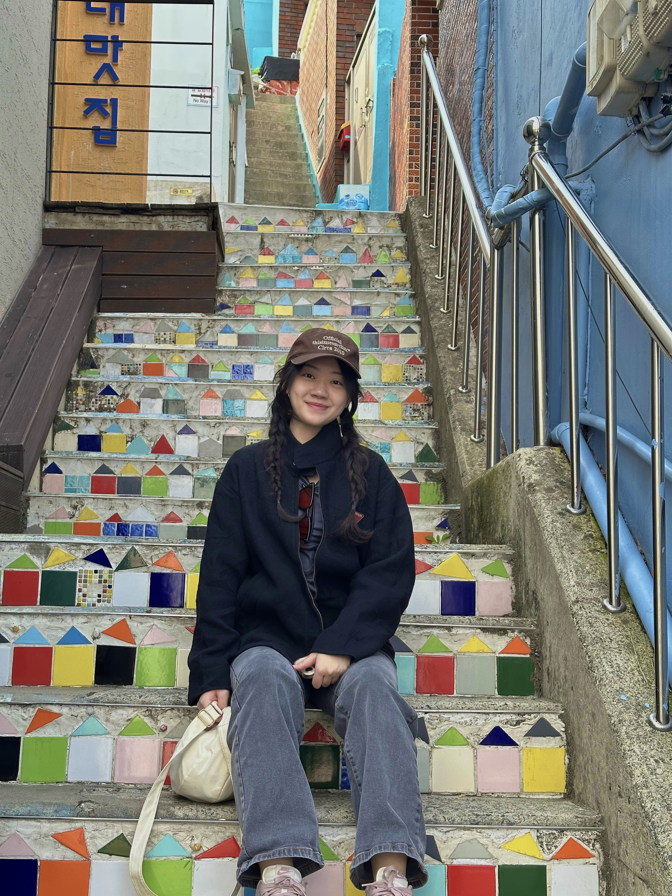

We are a team based in the [School of Computing, National University of Singapore](https://www.comp.nus.edu.sg).

## Project Team

### Yap Ze Kai

[[github](https://github.com/zekaistic)]

* Role: Team Lead, Developer
* Responsibilities: Deliverables and deadlines, Documentation

### Reyna Bong

[[github](http://github.com/reynabxr)]

* Role: Developer
* Responsibilities: UI

### Ong Yan Sheng

[[github](http://github.com/oysterboi)]

* Role: Developer
* Responsibilities: UI, Code Quality

### Esther Ker

[[github](https://github.com/estherkyx)]

* Role: Developer
* Responsibilities: Testing

### Lim Zhi Yan

[[github](https://github.com/zzzyans)]

* Role: Developer
* Responsibilities: UI, Scheduling and tracking
