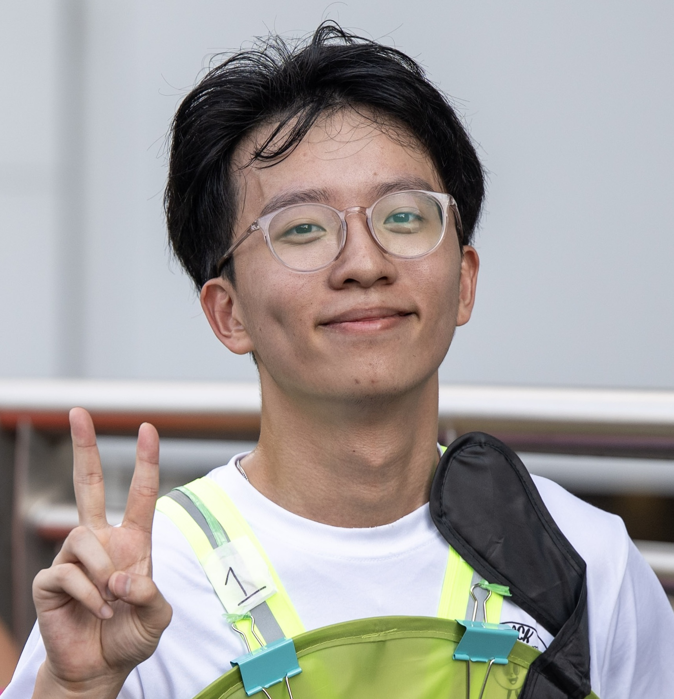
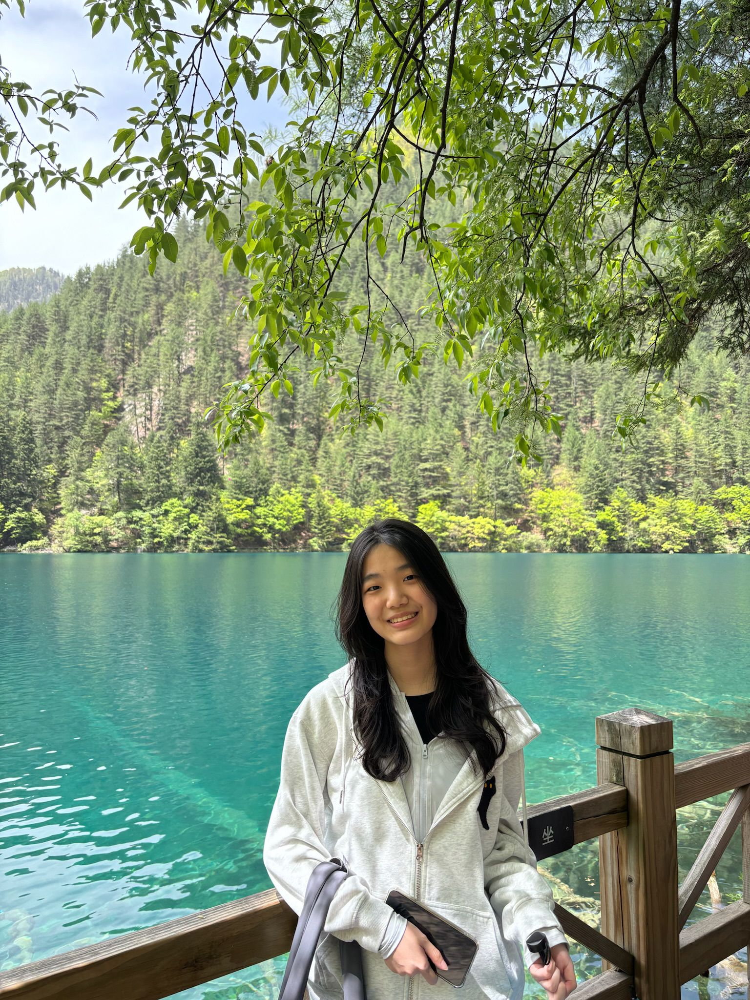
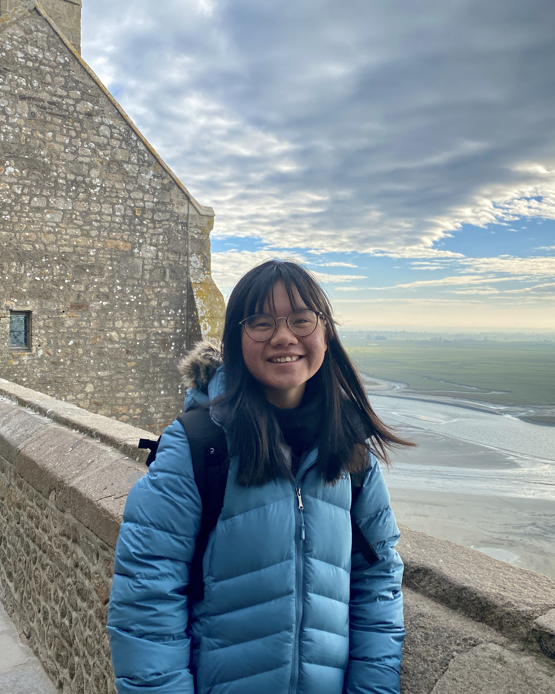

We are a team based in the [School of Computing, National University of Singapore](https://www.comp.nus.edu.sg).

You can reach us at the email `seer[at]comp.nus.edu.sg`

## Project team

### Yap Ze Kai

[[github](https://github.com/zekaistic)]
[[portfolio](team/johndoe.md)]

* Role: Team Lead, Developer
* Responsibilities: Deliverables and deadlines, Documentation

### Reyna Bong

[[github](http://github.com/reynabxr)]
[[portfolio](team/johndoe.md)]

* Role: Developer
* Responsibilities: UI

### Ong Yan Sheng

[[github](http://github.com/oysterboi)]
[[portfolio](team/johndoe.md)]

* Role: Developer
* Responsibilities: UI, Code Quality

### Esther Ker

[[github](https://github.com/estherkyx)]
[[portfolio](team/johndoe.md)]

* Role: Developer
* Responsibilities: Testing

### Jean Doe

[[github](http://github.com/johndoe)]
[[portfolio](team/johndoe.md)]

* Role: Developer
* Responsibilities: Dev Ops + Threading

### James Doe

[[github](http://github.com/johndoe)]
[[portfolio](team/johndoe.md)]

* Role: Developer
* Responsibilities: UI
