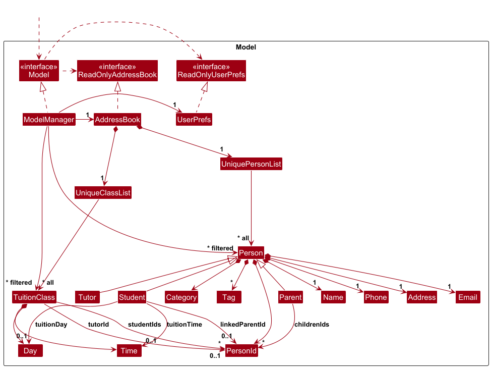
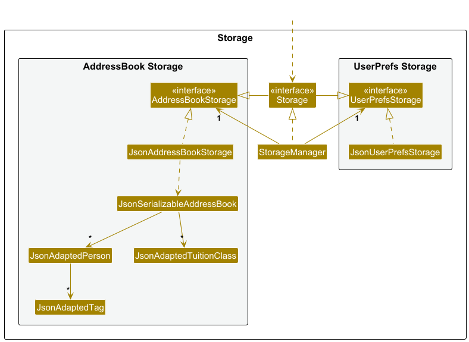
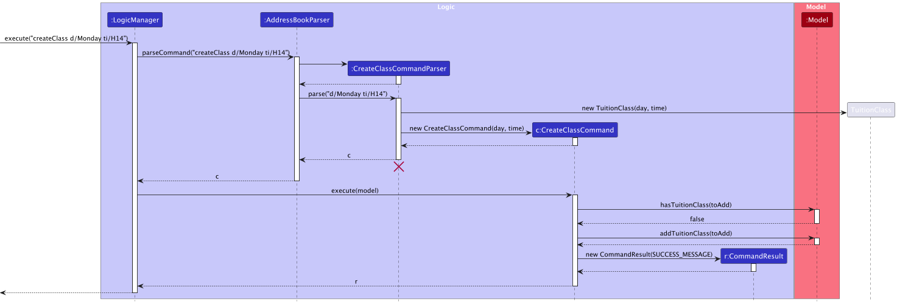

* Table of Contents
{:toc}

--------------------------------------------------------------------------------------------------------------------

## **Acknowledgements**

* {list here sources of all reused/adapted ideas, code, documentation, and third-party libraries -- include links to the original source as well}

--------------------------------------------------------------------------------------------------------------------

## **Setting up, getting started**

Refer to the guide [_Setting up and getting started_](SettingUp.md).

--------------------------------------------------------------------------------------------------------------------

## **Design**

:bulb: **Tip:** The `.puml` files used to create diagrams are in this document `docs/diagrams` folder. Refer to the [_PlantUML Tutorial_ at se-edu/guides](https://se-education.org/guides/tutorials/plantUml.html) to learn how to create and edit diagrams.

### Architecture

The ***Architecture Diagram*** given above explains the high-level design of the App.

Given below is a quick overview of main components and how they interact with each other.

**Main components of the architecture**

**`Main`** (consisting of classes [`Main`](https://github.com/se-edu/addressbook-level3/tree/master/src/main/java/seedu/address/Main.java) and [`MainApp`](https://github.com/se-edu/addressbook-level3/tree/master/src/main/java/seedu/address/MainApp.java)) is in charge of the app launch and shut down.
* At app launch, it initializes the other components in the correct sequence, and connects them up with each other.
* At shut down, it shuts down the other components and invokes cleanup methods where necessary.

The bulk of the app's work is done by the following four components:

* [**`UI`**](#ui-component): The UI of the App.
* [**`Logic`**](#logic-component): The command executor.
* [**`Model`**](#model-component): Holds the data of the App in memory.
* [**`Storage`**](#storage-component): Reads data from, and writes data to, the hard disk.

[**`Commons`**](#common-classes) represents a collection of classes used by multiple other components.

**How the architecture components interact with each other**

The *Sequence Diagram* below shows how the components interact with each other for the scenario where the user issues the command `delete 1`.

Each of the four main components (also shown in the diagram above),

* defines its *API* in an `interface` with the same name as the Component.
* implements its functionality using a concrete `{Component Name}Manager` class (which follows the corresponding API `interface` mentioned in the previous point.

For example, the `Logic` component defines its API in the `Logic.java` interface and implements its functionality using the `LogicManager.java` class which follows the `Logic` interface. Other components interact with a given component through its interface rather than the concrete class (reason: to prevent outside component's being coupled to the implementation of a component), as illustrated in the (partial) class diagram below.

The sections below give more details of each component.

### UI component

The **API** of this component is specified in [`Ui.java`](https://github.com/se-edu/addressbook-level3/tree/master/src/main/java/seedu/address/ui/Ui.java)

The UI consists of a `MainWindow` that is made up of parts e.g.`CommandBox`, `ResultDisplay`, `PersonListPanel`, `StatusBarFooter` etc. All these, including the `MainWindow`, inherit from the abstract `UiPart` class which captures the commonalities between classes that represent parts of the visible GUI.

The `UI` component uses the JavaFx UI framework. The layout of these UI parts are defined in matching `.fxml` files that are in the `src/main/resources/view` folder. For example, the layout of the [`MainWindow`](https://github.com/se-edu/addressbook-level3/tree/master/src/main/java/seedu/address/ui/MainWindow.java) is specified in [`MainWindow.fxml`](https://github.com/se-edu/addressbook-level3/tree/master/src/main/resources/view/MainWindow.fxml)

The `UI` component,

* executes user commands using the `Logic` component.
* listens for changes to `Model` data so that the UI can be updated with the modified data.
* keeps a reference to the `Logic` component, because the `UI` relies on the `Logic` to execute commands.
* depends on some classes in the `Model` component, as it displays `Person` object residing in the `Model`.

### Logic component

**API** : [`Logic.java`](https://github.com/se-edu/addressbook-level3/tree/master/src/main/java/seedu/address/logic/Logic.java)

Here's a (partial) class diagram of the `Logic` component:

The sequence diagram below illustrates the interactions within the `Logic` component, taking `execute("delete 1")` API call as an example.

:information_source: **Note:** The lifeline for `DeleteCommandParser` should end at the destroy marker (X) but due to a limitation of PlantUML, the lifeline continues till the end of diagram.

How the `Logic` component works:

1. When `Logic` is called upon to execute a command, it is passed to an `AddressBookParser` object which in turn creates a parser that matches the command (e.g., `DeleteCommandParser`) and uses it to parse the command.
1. This results in a `Command` object (more precisely, an object of one of its subclasses e.g., `DeleteCommand`) which is executed by the `LogicManager`.
1. The command can communicate with the `Model` when it is executed (e.g. to delete a person). 
   Note that although this is shown as a single step in the diagram above (for simplicity), in the code it can take several interactions (between the command object and the `Model`) to achieve.
1. The result of the command execution is encapsulated as a `CommandResult` object which is returned back from `Logic`.

Here are the other classes in `Logic` (omitted from the class diagram above) that are used for parsing a user command:

How the parsing works:
* When called upon to parse a user command, the `AddressBookParser` class creates an `XYZCommandParser` (`XYZ` is a placeholder for the specific command name e.g., `AddCommandParser`) which uses the other classes shown above to parse the user command and create a `XYZCommand` object (e.g., `AddCommand`) which the `AddressBookParser` returns back as a `Command` object.
* All `XYZCommandParser` classes (e.g., `AddCommandParser`, `DeleteCommandParser`, ...) inherit from the `Parser` interface so that they can be treated similarly where possible e.g, during testing.

### Model component
**API** : [`Model.java`](https://github.com/se-edu/addressbook-level3/tree/master/src/main/java/seedu/address/model/Model.java)

The `Model` component,

* stores the address book data i.e., all `Person` objects (which are contained in a `UniquePersonList` object).
* stores the currently 'selected' `Person` objects (e.g., results of a search query) as a separate _filtered_ list which is exposed to outsiders as an unmodifiable `ObservableList<Person>` that can be 'observed' e.g. the UI can be bound to this list so that the UI automatically updates when the data in the list change.
* stores a `UserPref` object that represents the user’s preferences. This is exposed to the outside as a `ReadOnlyUserPref` objects.
* does not depend on any of the other three components (as the `Model` represents data entities of the domain, they should make sense on their own without depending on other components)

:information_source: **Note:** An alternative (arguably, a more OOP) model is given below. It has a `Tag` list in the `AddressBook`, which `Person` references. This allows `AddressBook` to only require one `Tag` object per unique tag, instead of each `Person` needing their own `Tag` objects. 

### Storage component

**API** : [`Storage.java`](https://github.com/se-edu/addressbook-level3/tree/master/src/main/java/seedu/address/storage/Storage.java)

The `Storage` component,
* can save both address book data and user preference data in JSON format, and read them back into corresponding objects.
* inherits from both `AddressBookStorage` and `UserPrefStorage`, which means it can be treated as either one (if only the functionality of only one is needed).
* depends on some classes in the `Model` component (because the `Storage` component's job is to save/retrieve objects that belong to the `Model`)

### Common classes

Classes used by multiple components are in the `seedu.address.commons` package.

--------------------------------------------------------------------------------------------------------------------

## **Implementation**

This section describes some noteworthy details on how certain features are implemented.

### Create New Class Timeslot: `createClass` feature

The `createClass` feature is responsible for creating new, empty tuition class timeslots in the system. It enforces the core business rule that there can only be one class per unique day and time combination.

#### Implementation

The mechanism is facilitated by several key components working together:

1.  **`ClassId` Value Object**: This is an immutable class that encapsulates the unique identity of a tuition class, which is defined by its `Day` and `Time`. This allows the system to treat a timeslot as a single, cohesive concept.

2.  **`TuitionClass` Model**: This class represents a single tuition class. Upon creation via the `createclass` command, it is initialized with a `ClassId` but has its `tutorId` set to `null` and an empty list of `studentIds`.

3.  **`UniqueClassList`**: This data structure, held within the `AddressBook`, stores all `TuitionClass` objects. Its primary responsibility is to enforce uniqueness. It uses the `TuitionClass#equals()` method (which in turn uses `ClassId#equals()`) to prevent any duplicate timeslots from being added.

4.  **`CreateClassCommand` and `CreateClassCommandParser`**: These handle the parsing of user input and the orchestration of the creation logic.

The `execute()` method in `CreateClassCommand` performs the following key operations:
*   It first creates a new `TuitionClass` object using the `Day` and `Time` provided by the user.
*   It then calls `model.hasTuitionClass(newClass)` to check if a class at that timeslot already exists. This check is the core of the duplicate prevention mechanism.
*   If no duplicate is found, it calls `model.addTuitionClass(newClass)` to add the new class to the `AddressBook`.

---
#### Usage Scenario

Given below is an example usage scenario and how the `createClass` mechanism behaves at each step.

**Step 1.** The user executes the command `createClass d/Monday ti/H14`.

**Step 2.** The `LogicManager` passes the command string to the `AddressBookParser`. The parser identifies the `createClass` command word and delegates the parsing of the arguments (`d/Monday ti/H14`) to the `CreateClassCommandParser`.

**Step 3.** The `CreateClassCommandParser` tokenizes the arguments, validates that both `d/` and `ti/` prefixes are present, and parses the values into `Day.MONDAY` and `Time.H14` enums. It then instantiates and returns a `new CreateClassCommand(Day.MONDAY, Time.H14)`.

**Step 4.** The `LogicManager` calls the `execute()` method on the returned `CreateClassCommand`.

**Step 5.** Inside `execute()`, a new `TuitionClass` object is created. The command then calls `model.hasTuitionClass()` to check for duplicates. This method leverages the `UniqueClassList`, which iterates through its existing classes and uses `TuitionClass#equals()` to compare them. Since no class exists for Monday at H14, this check returns `false`.

:information_source: **Note:** The uniqueness of a `TuitionClass` is strictly defined by its `ClassId` (which is composed of its `Day` and `Time`). The `equals()` method in `TuitionClass` compares only the `ClassId`, ensuring that two classes are considered duplicates if and only if they occupy the same timeslot, regardless of their tutor or student list.

**Step 6.** Since no duplicate was found, the command proceeds to call `model.addTuitionClass()`, which adds the new, empty `TuitionClass` object to the `AddressBook`'s internal `UniqueClassList`.

**Step 7.** A `CommandResult` with a success message (e.g., "New class created: Monday, 1400") is returned and displayed to the user.

The following sequence diagram illustrates the process:

:information_source: **Note:** The lifeline for `CreateClassCommandParser` should end at the destroy marker (X) but due to a limitation of PlantUML, the lifeline reaches the end of diagram.

### \[Proposed\] Data archiving

_{Explain here how the data archiving feature will be implemented}_

--------------------------------------------------------------------------------------------------------------------

## **Documentation, logging, testing, configuration, dev-ops**

* [Documentation guide](Documentation.md)
* [Testing guide](Testing.md)
* [Logging guide](Logging.md)
* [Configuration guide](Configuration.md)
* [DevOps guide](DevOps.md)

--------------------------------------------------------------------------------------------------------------------

## **Appendix: Requirements**

### Product Scope

**Target user profile**: The target user is a **tech-savvy GP (General Paper) tuition receptionist**. More broadly,
this includes tech-savvy tuition teachers and receptionists who need to manage a significant number of contacts
across various groups and schedules. The ideal user:
* Can type fast.
* Prefers typing and using a CLI over mouse interactions.
* Prefers desktop applications for management tasks.

**Value proposition**: Helps a tuition centre manager keep track of students, their personal details (like family
contacts), their classes, and schedules. The app allows for quick management of contact details and classes for a
number of JC-level tutees and their tutors, enabling users to manage contacts faster than with a typical
mouse/GUI-driven app. It will not manage other details such as grades and tuition fees.

### User Stories

Priorities: High (must have) - `* * *`, Medium (nice to have) - `* *`, Low (unlikely to have) - `*`

| Priority | As a …​        | I want to …​                                                   | So that I can…​                                                          |
|----------|----------------|----------------------------------------------------------------|--------------------------------------------------------------------------|
| `* * *`  | new user       | add a new student with their personal details                  | maintain accurate contact information for enrollment and communication     |
| `* * *`  | new user       | add a parent with their personal details                       | contact parents about their child's progress and class updates            |
| `* * *`  | new user       | add a tutor with their details                                 | assign tutors to appropriate classes based on their expertise             |
| `* * *`  | new user       | view the details of each student                               | quickly find student contact info when parents call or students need help |
| `* * *`  | new user       | view the details of each parent                                | reach parents immediately for urgent matters or schedule changes          |
| `* * *`  | new user       | view the details of each tutor                                 | contact tutors about schedule changes or class assignments               |
| `* * *`  | regular user   | delete an existing student and their details                   | remove a student that has left the tuition centre                          |
| `* * *`  | regular user   | delete an existing parent and their details                    | remove the parent of a student that has left the tuition centre            |
| `* * *`  | regular user   | delete an existing tutor and their details                     | remove a tutor that has left the tuition centre                            |
| `* *`    | new user       | create class timings                                           | organize weekly schedules and avoid double-booking tutors                 |
| `* *`    | regular user       | assign each student to a class timing and a parent    | track which students attend which classes and who to contact              |
| `* *`    | regular user   | search for a student by name                                   | find their personal details quickly                                      |
| `*`      | expert user    | move a student from one class to another                       | easily accommodate schedule changes for students                         |
| `*`      | expert user    | view a tutor's weekly schedule                                 | know when they are teaching, and when they are free                      |
| `*`      | expert user    | tag students (eg. "Different GP syllabus", "Needs extra help") | group students by learning needs and create targeted lesson plans         |

### Use Cases

(For all use cases below, the **System** is `TutorFlow` and the **Actor** is the `user`, unless specified otherwise)

**Use case: UC1 - Add a person**

**MSS**

1.  User requests to add a person with a specific category (student, parent, or tutor), name, phone number, address, and email.
2.  TutorFlow shows the newly added contact at the top of the list with a success message.

    Use case ends.

**Extensions**

*   1a. The user enters an invalid command.
    *   1a1. TutorFlow shows an error message: _"Unknown command"._

        Use case ends.

*   1b. The user enters a command with an invalid format.
    *   1b1. TutorFlow shows an error message: _"Invalid command format!"_

        Use case ends.

*   1c. The user enters an invalid category (not "student", "tutor", or "parent").
    *   1c1. TutorFlow shows an error message: _"Invalid category"._

        Use case ends.

*   1d. The user provides an empty name.
    *   1d1. TutorFlow shows an error message: _"Names should only contain alphanumeric characters and spaces, and it should not be blank"._

        Use case ends.

*   1e. The user provides an invalid phone number (e.g., not at least 3 digits/contains non-numbers).
    *   1e1. TutorFlow shows an error message: _"Phone numbers should only contain numbers, and it should be at least 3 digits long"._

        Use case ends.

*   1f. The user provides an invalid email format.
    *   1f1. TutorFlow shows an error message: _"Emails should be of the format local-part@domain"._

        Use case ends.

*   1g. The provided name and category already exists in the contact list. (Person already exists)
    *   1g1. TutorFlow shows an error message: _"This person already exists in the address book"._

        Use case ends.

--------------------------------------------------------------------------------------------------------------------

**Use case: UC2 - Delete a person**

**MSS**

1.  User requests to list persons.
2.  TutorFlow shows a list of persons.
3.  User requests to delete a specific person in the list by their index.
4.  TutorFlow deletes the person.
5.  TutorFlow refreshes the contact list and shows a success message.

    Use case ends.

**Extensions**

*   2a. The list is empty.

    Use case ends.

*   3a. The given index is not a positive integer.
    *   3a1. TutorFlow shows an error message: _"Invalid command format!"_

        Use case ends.

*   3b. The given index is out of range (e.g., greater than the list size).
    *   3b1. TutorFlow shows an error message: _"The person index provided is invalid"._

        Use case ends.

--------------------------------------------------------------------------------------------------------------------

**Use case: UC3 - Creating a class**

**MSS**

1.  User requests to create a new class with specific timing and details.
2.  TutorFlow shows a success message confirming the class creation.

    Use case ends.

**Extensions**

*   1a. The user provides an invalid day format.
    *   1a1. TutorFlow shows an error message: _"Day must be a valid day of the week (e.g., MONDAY, Tuesday)."_

        Use case ends.

*   1b. The user provides an invalid time format.
    *   1b1. TutorFlow shows an error message: _"Time must be one of the following: H12, H14, H16, H18, H20"._

        Use case ends.

*   1c. The user provides a day and timing that conflicts with an existing class.
    *   1c1. TutorFlow shows an error message: _"This class time slot already exists"._

        Use case ends.

--------------------------------------------------------------------------------------------------------------------

**Use case: UC4 - View all classes**

**MSS**

1.  User requests to view all classes.
2.  TutorFlow displays the full numbered list of all classes with their days and timings.

    Use case ends.

**Extensions**

*   2a. There are no classes to display.
    *   2a1. TutorFlow shows an empty list and displays the message: _"There are no tuition classes in the system."_

        Use case ends.

--------------------------------------------------------------------------------------------------------------------

**Use case: UC5 - View classes taught by a specific tutor**

**Preconditions**: At least 1 tutor exists in the system

1.  User requests to view classes for a specific tutor.
2.  TutorFlow displays a filtered list of classes taught by that tutor.

    Use case ends.

**Extensions**

*   1a. The name given is not a tutor.
    * 1a1. TutorFlow shows an error message: _"Tutor with name '[tutor_name]' not found."_

        Use case ends.

--------------------------------------------------------------------------------------------------------------------

**Use case: UC6 - Link a parent to a student**

**Preconditions**: At least 1 student and 1 parent exists in the system

**MSS**

1.  User requests to link a parent to a student by specifying both names.
2.  TutorFlow links the parent to the student.
3.  TutorFlow shows a success message confirming the link.

    Use case ends.

**Extensions**

*   1a. Either the student or parent name is not found.
    *   1a1. TutorFlow shows an error message: _"The person with name [student_name/parent_name] could not be found."_

        Use case ends.

*   1b. The specified parent is not categorized as `parent`.
    *   1b1. TutorFlow shows an error message: _"The person [person_name] is not a Parent."_

        Use case ends.

*   1c. The specified student is not categorized as `student`.
    *   1c1. TutorFlow shows an error message: _"The person [person_name] is not a Student."_

        Use case ends.

*   1d. The parent is already linked to the student.
    *   1d1. TutorFlow shows an error message: _"Parent already linked to this student."_

        Use case ends.

--------------------------------------------------------------------------------------------------------------------

**Use case: UC7 - Link a class to a student**

**Preconditions**: At least 1 class and 1 student exists in the system

**MSS**

1.  User requests to link a student to a class by specifying the student name and class index (or identifier).
2.  TutorFlow validates the student exists and the class exists.
3.  TutorFlow links the student to the class.
4.  TutorFlow shows a success message confirming the link.

    Use case ends.

**Extensions**

*   1a. The student name is not found.
    *   1a1. TutorFlow shows an error message: _"The person with the name '[person_name]' could not be found."_

        Use case ends.

*   1b. The class identifier is invalid.
    *   1b1. TutorFlow shows an error message: _"The class at the specified timeslot does not exist."_

        Use case ends.

*   1c. The student is already linked to a class.
    *   1c1. TutorFlow shows an error message: _"The student is already linked to a class."_

        Use case ends.

--------------------------------------------------------------------------------------------------------------------

**Use case: UC8 - Unlink a class from a student**

**Preconditions**: At least 1 class and 1 student exists in the system

**MSS**

1.  User requests to unlink a student from a class by specifying the student name and class index (or identifier).
2.  TutorFlow validates the link exists.
3.  TutorFlow removes the link.
4.  TutorFlow shows a success message confirming the unlink.

    Use case ends.

**Extensions**

*   1a. The student name is not found.
    *   1a1. TutorFlow shows an error message: _"The person with the name '[person_name]' could not be found."_

        Use case ends.

*   1b. The class identifier is invalid.
    *   1b1. TutorFlow shows an error message: _"The class at the specified timeslot does not exist."_

        Use case ends.

*   1c. The student is not linked to the class.
    *   1c1. TutorFlow shows an error message: _"The student is not linked to this class"._

        Use case ends.

--------------------------------------------------------------------------------------------------------------------

**Use case: UC9 - Get details of a class**

**Preconditions**: At least 1 class exists in the system

**MSS**

1.  User requests details of a specific class by providing the class day and time.
2.  TutorFlow retrieves the class information (day, time, assigned tutor, enrolled students).
3.  TutorFlow displays the class details.

    Use case ends.

**Extensions**

*   1a. The class day or time is invalid.
    *   1a1. TutorFlow shows an error message: _"There is no class at the specified day and time"._

        Use case ends.

*   2a. The class has no enrolled students or no assigned tutor.
    *   2a1. TutorFlow displays placeholders indicating missing information (e.g., _"Tutor: None"_).

        Use case ends.

--------------------------------------------------------------------------------------------------------------------

**Use case: UC10 - Get all students in the system**

**MSS**

1.  User requests to view all students.
2.  TutorFlow displays a filtered list containing only contacts categorized as `student`.

    Use case ends.

**Extensions**

*   2a. There are no students to display.
    *   2a1. TutorFlow shows an empty list and displays the message: _"There    are no students in the system."_

        Use case ends.

*   2a. The tutor has no linked classes.
    *   2a1. TutorFlow shows an empty list and displays the message: _"No classes found for tutor [tutor_name]."_

        Use case ends.

--------------------------------------------------------------------------------------------------------------------

 **Use case: UC11 - Edit a person**
 
 **Preconditions**: At least 1 person exists in the system
 
 **MSS**
 
 1.  User requests to list persons.
 2.  TutorFlow shows a list of persons.
 3.  User requests to edit a specific person in the list by their index, providing one or more updated fields (e.g., name, phone, email, address, category, tags).
 5.  TutorFlow updates the person, refreshes the contact list, and shows a success message.
 
     Use case ends.
 
 **Extensions**
 
 *   2a. The list is empty.
 
     Use case ends.
 
 *   3a. The given index is not a positive integer.
     *   3a1. TutorFlow shows an error message: _"Invalid command format!"_
 
         Use case ends.
 
 *   3b. The given index is out of range (e.g., greater than the list size).
     *   3b1. TutorFlow shows an error message: _"The person index provided is invalid."_
 
         Use case ends.
 
 *   3c. No fields are provided to edit.
     *   3c1. TutorFlow shows an error message: _"At least one field to edit must be provided."_
 
         Use case ends.
 
 *   3d. The user provides an invalid name.
     *   3d1. TutorFlow shows an error message: _"Names should only contain alphanumeric characters and spaces, and it should not be blank"._
 
         Use case ends.
 
 *   3e. The user provides an invalid phone number (e.g., not at least 3 digits/contains non-numbers).
     *   3e1. TutorFlow shows an error message: _"Phone numbers should only contain numbers, and it should be at least 3 digits long"._
 
         Use case ends.
 
 *   3f. The user provides an invalid email format.
     *   3f1. TutorFlow shows an error message: _"Emails should be of the format local-part@domain"._
 
         Use case ends.
 
 *   3g. The user provides an invalid category.
     *   3g1. TutorFlow shows an error message: _"Invalid category"._
 
         Use case ends.
 
 *   3h. The edited details would duplicate an existing person (same identifying fields).
     *   3h1. TutorFlow shows an error message: _"This person already exists in the address book"._
 
         Use case ends.

---
 
### Non-Functional Requirements

1. Should work on any mainstream OS as long as it has Java 17 or above installed.
2. Should be able to hold up to 1000 persons without a noticeable sluggishness in performance for typical usage.
3. A user with above average typing speed for regular English text (i.e. not code, not system admin commands) should be able to accomplish most of the tasks faster using commands than using the mouse.
4. Typical commands (e.g., list, add, delete) should complete within 200 ms on a dataset of 1000 persons on a standard laptop from the last 5 years.
5. The system should work without internet access.
6. A user should be able to learn how to use TutorFlow to a reasonable degree within an hour of usage.
7. The application should not be larger than 50Mb.
8. The application should never crash during execution, and should only show warning messages.

### Glossary

* **Actor**: An entity that interacts with TutorFlow. In most use cases, this is the user.
* **Category**: The role assigned to a contact, which can be 'student', 'parent', or 'tutor'.
* **CLI** (Command-Line Interface): The text-based input field where users type commands to interact with the application.
* **Index**: The 1-based number that identifies a contact's position in the displayed list.
* **Mainstream OS**: Windows, Linux, Unix, MacOS.
* **MSS** (Main Success Scenario): A term used in use cases to describe the ideal workflow where everything happens as expected without any errors.
* **Class (tuition class)**: A scheduled GP tuition session identified by a day and time slot.
* **Command**: A textual instruction entered in the CLI to perform an action (e.g., `add`, `delete`).
* **Dataset**: The collection of all stored contacts and classes used by the application.
* **JSON** (JavaScript Object Notation): The data format used by TutorFlow to persist information to disk.
* **Tag**: A label attached to a contact to group or describe them (e.g., "Needs extra help").

--------------------------------------------------------------------------------------------------------------------

## **Appendix: Instructions for manual testing**

Given below are instructions to test the app manually.

:information_source: **Note:** These instructions only provide a starting point for testers to work on;
testers are expected to do more *exploratory* testing.

### Launch and shutdown

1. Initial launch

   1. Download the jar file and copy into an empty folder

   1. Double-click the jar file Expected: Shows the GUI with a set of sample contacts. The window size may not be optimum.

1. Saving window preferences

   1. Resize the window to an optimum size. Move the window to a different location. Close the window.

   1. Re-launch the app by double-clicking the jar file. 
       Expected: The most recent window size and location is retained.

1. _{ more test cases …​ }_

### Deleting a person

1. Deleting a person while all persons are being shown

   1. Prerequisites: List all persons using the `list` command. Multiple persons in the list.

   1. Test case: `delete 1` 
      Expected: First contact is deleted from the list. Details of the deleted contact shown in the status message. Timestamp in the status bar is updated.

   1. Test case: `delete 0` 
      Expected: No person is deleted. Error details shown in the status message. Status bar remains the same.

   1. Other incorrect delete commands to try: `delete`, `delete x`, `...` (where x is larger than the list size) 
      Expected: Similar to previous.

1. _{ more test cases …​ }_

### Saving data

1. Dealing with missing/corrupted data files

   1. _{explain how to simulate a missing/corrupted file, and the expected behavior}_

1. _{ more test cases …​ }_

---
## **Appendix: Effort**
TutorFlow evolved from the AddressBook Level 3 (AB3) codebase. While AB3 supports only one entity type (`Person`), TutorFlow introduces and manages three person-based entity types (`Student`, `Tutor`, and `Parent`) as well as a non-person entity (`TuitionClass`). Extending AB3 into a multi-entity, relationship-aware system required major redesigns to its model, command logic, storage, and tests.

### Key Challenges and Effort

| Feature / Area                                 | Description of Work                                                                                                                                                          | AB3 Reuse                                                                            | Additional Complexity                                                                                       |
|------------------------------------------------|------------------------------------------------------------------------------------------------------------------------------------------------------------------------------|--------------------------------------------------------------------------------------|-------------------------------------------------------------------------------------------------------------|
| **Multi-Entity Data Model and Relationships**  | Refactored `Person` into `Student`, `Tutor`, and `Parent` subclasses, and added a new `TuitionClass` entity to represent lessons and linked relationships.                   | ~25% (Reused `Person` base structure and `UniquePersonList` as foundation)           | Cross-layer refactoring, ensuring data consistency, and extensive testing for linked entities.              |
| **Relationship and Class Management Commands** | Added new relational commands (`linkParent`, `getParent`, `createClass`, `linkClass`, `unlinkClass`, `getClassDetails`, `getStudents`) to manage links and class scheduling. | ~20% (Reused AB3’s `Command` hierarchy, `LogicManager`, and parser framework)        | Designing linkage logic, handling  edits/deletions of entities, and debugging interdependent relationships. |
| **Persistence and Storage**                    | Extended JSON storage to handle subclasses and `TuitionClass`, maintaining compatibility with AB3’s format.                                                                  | ~40% (Reused JSON read/write infrastructure and adapted `JsonAdaptedPerson`)         | Managing subclass serialisation, maintaining referential integrity, and preventing data corruption.         |
| **UI Enhancements**                            | Enhanced JavaFX UI to display categories (*student*, *tutor*, *parent*), relationships (linked parents/children), and class timings.                                         | ~60% (Reused AB3’s UI layout and `MainWindow`/`CommandBox` components)               | Implementing dynamic data bindings, relational displays, and contextual command feedback.                   |
| **Testing and Integration**                    | Rebuilt tests for all new features and relationships, extended utilities like `CommandTestUtil` for multi-entity support.                                                    | ~10% (Reused testing structure but rewrote test cases for new entities and commands) | Extensive testing, cross-entity validation, and coverage for complex interactions.                          |

### Achievements
* Expanded AB3’s single-entity model into a multi-entity, relationship-aware system. 
* Implemented relational and scheduling features (e.g. `linkParent`, `linkClass`) with consistent data handling. 
* Enhanced the UI to visualise categories, relationships, and class timings. 
* Preserved AB3’s structure while substantially increasing functionality and technical depth.
