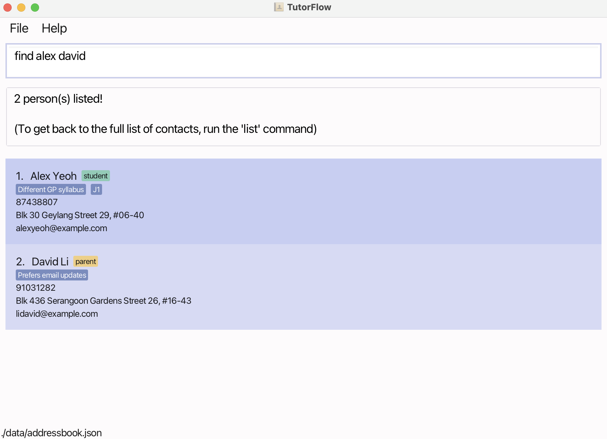
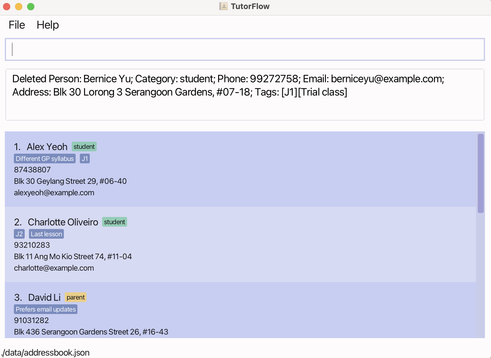

TutorFlow is a desktop app for tuition centre managers. It helps you keep track of students, parents, tutors, and classes using simple type-and-press-Enter commands. For those comfortable with a command line, TutorFlow can get your contact management tasks done quickly and easily.

* Table of Contents
{:toc}

--------------------------------------------------------------------------------------------------------------------

## Quick Start

1. Install Java `17` or newer on your computer. 
   **Mac users:** Follow the guide [here](https://se-education.org/guides/tutorials/javaInstallationMac.html).

2. Download the latest app file (`.jar`) from [the Releases page](https://github.com/AY2526S1-CS2103T-T11-4/tp/releases).

3. Copy the file into a folder where you want your TutorFlow data to be saved.

4. Open a command window/terminal, go to that folder, and run: `java -jar TutorFlow.jar` 
   The app window should appear with sample data so you can try things out. 
   

5. Type a command in the box and press Enter. For example, type **`help`** and press Enter to open the help window. 
   Some example commands you can try:

   * `list` : Lists all contacts.

   * `add c/student n/John Doe p/98765432 e/johnd@example.com a/John street, block 123, #01-01` : Adds a student named `John Doe` to the address book.

   * `delete 3` : Deletes the 3rd contact shown in the current list.

   * `clear` : Deletes all contacts.

   * `exit` : Exits the app.

6. Refer to the [Features](#features) below for details of each command.

--------------------------------------------------------------------------------------------------------------------

## Features

**:information_source: How to read command formats** 

*  `UPPER_CASE`: These are placeholders that you replace with your own information.  
  For example, in `n/NAME`, you replace `NAME` with the actual name: `n/John Doe`.

* `[square_brackets]`: These indicate optional parts of a command. You can leave them out if you don't need them. 
  Example: `n/NAME [t/TAG]` can be `n/John Doe t/J1` or just `n/John Doe`.

* `…`(ellipsis): This means you can provide multiple of the preceding item (including zero).  
  Example: `[t/TAG]…` can be left out, or used like `t/J1`, or `t/J2 t/Trial lesson `.

* Extra text for commands that don't take inputs (like `help`, `exit`, `clear`) will be ignored.  
  Example: `help 123` is treated as `help`.

### Viewing help : `help`

Shows a message explaining how to access the help page.

Format: `help`

• [Back to Command Summary](#command-summary)

### Adding a person: `add`

Adds a person to the address book.

Format: `add c/CATEGORY n/NAME p/PHONE_NUMBER e/EMAIL a/ADDRESS [t/TAG]…​`

:bulb: **Tip:**
A person can have any number of tags (including 0)

Examples:
* `add c/student n/John Doe p/98765432 e/johnd@example.com a/John street, block 123, #01-01`
* `add c/tutor n/Betsy Crowe t/GP Paper 1 e/betsycrowe@example.com a/Newgate Prison p/1234567 t/New hire`

• [Back to Command Summary](#command-summary)

### Listing all persons : `list`

Shows a list of all persons in the address book. If you add a category, it shows all persons belonging to that category.

Format: `list [c/CATEGORY]`

* Without `c/CATEGORY`: shows all persons in the system.
* With `c/CATEGORY`: shows all persons belonging to the specified category `tutor`, `student`, `parent` (case-insensitive).

Examples:
* `list` shows all persons.
* `list c/tutor` shows all tutors.
* `list c/STUDENT` shows all students.
* `list c/Parent` shows all parents.

• [Back to Command Summary](#command-summary)

### Editing a person : `edit`

Edits an existing person in the address book.

Format: `edit INDEX [c/CATEGORY] [n/NAME] [p/PHONE] [e/EMAIL] [a/ADDRESS] [t/TAG]…​`

* Edits the person at the specified `INDEX` from the currently displayed contact list. The index **must be a positive integer** 1, 2, 3, …​
* You must provide at least one field to change (e.g., n/, p/, etc.).
* Editing tags will **replace all old tags** with the new ones you provide. To clear all tags, simply type t/ with nothing after it.

Examples:
*  `edit 1 p/91234567 e/johndoe@example.com` Edits the phone number and email address of the 1st person to be `91234567` and `johndoe@example.com` respectively.
*  `edit 2 n/Betsy Crower t/` Edits the name of the 2nd person to be `Betsy Crower` and clears all existing tags.

• [Back to Command Summary](#command-summary)

### Linking a student to a parent : `linkParent`

Links an existing student to an existing parent in the address book.

Format: `linkParent n/STUDENT_NAME n/PARENT_NAME`

* Links the student identified by STUDENT_NAME to the parent identified by PARENT_NAME.
* Both the student and the parent must already exist in the address book.
* The names must be an **exact match** to the names stored in TutorFlow.
* The person identified as the student must have the 'student' category, and the person identified as the parent must have the 'parent' category.
* A student can only be linked to **one** parent.

Example:
* `linkParent n/Alice Pauline n/Daniel Meier` Links the student 'Alice Pauline' to the parent 'Daniel Meier', assuming both exist in the address book with the correct categories.

• [Back to Command Summary](#command-summary)

### Locating persons by name: `find`

Finds persons whose names contain any of the given keywords.

Format: `find KEYWORD [MORE_KEYWORDS]`

* The search is case-insensitive. e.g. `hans` will match `Hans`
* The order of the keywords does not matter. e.g. `Hans Bo` will match `Bo Hans`
* Only the name is searched.
* Only full words will be matched e.g. `Han` will not match `Hans`
* Persons matching at least one keyword will be returned (i.e. `OR` search).
  e.g. `Hans Bo` will return `Hans Gruber`, `Bo Yang`

Examples:
* `find John` returns `john` and `John Doe`
* `find alex david` returns `Alex Yeoh`, `David Li` 

  

• [Back to Command Summary](#command-summary)

### Finding a student's parent: `getParent`

Displays the parent of a specified student.

Format: `getParent n/STUDENT_NAME`
* The student must already exist in the address book.
* The student name must be an exact match to the name stored in TutorFlow.
* The student identified must have the 'student' category.

Examples:
* `getParent n/John Doe` shows the parent of student John Doe.

• [Back to Command Summary](#command-summary)

### Finding all students of a tutor: `getStudents`

Displays all students of a specified tutor.

Format: `getStudents n/TUTOR_NAME`
* The tutor must already exist in the address book.
* The tutor name must be an exact match to the name stored in TutorFlow.
* The tutor identified must have the 'tutor' category.

Examples:
* `getStudents n/Roy Balakrishnan` shows all students of  tutor Roy Balakrishnan.

• [Back to Command Summary](#command-summary)

### Creating a class: `createClass`

Creates a new class in the system. Create this first before linking a tutor and students to it.

Format: `createClass d/DAY ti/TIME`

* `DAY` must be one of `MONDAY`, `TUESDAY`, `WEDNESDAY`, `THURSDAY`, `FRIDAY`, `SATURDAY`, `SUNDAY` (case-insensitive).
* `TIME` must be a supported timeslot `H12`, `H14`, `H16`, `H18`, `H20` (case-insensitive), which represents `12:00PM`, `2:00PM`, `4:00PM`, `6:00PM`, `8:00PM` respectively.
* The class is created without linked persons. Link a tutor or student using `linkClass`.

:bulb: **Tip:**
Each timeslot (a combination of a day and a time) is unique. You cannot create a class for a timeslot that is already taken.

Examples:
* `createClass d/MONDAY ti/H16` creates a class on Monday at 4:00 PM.
* `createClass d/TUESDAY ti/H12` creates a class on Tuesday at 12:00 PM.

See also: [`linkClass`](#linking-a-person-to-a-class-linkclass), [`getClassDetails`](#viewing-class-details-getclassdetails)

• [Back to Command Summary](#command-summary)

### Linking a person to a class: `linkClass`

Links an existing student or tutor to an existing class.

Format: `linkClass d/DAY ti/TIME n/NAME`

* `NAME` must **exactly match** a person in TutorFlow.
* The class identified by `DAY` and `TIME` (case-insensitive) must already exist (created using `createClass`).

---
The `linkClass` command works differently for students and tutors. Here’s what you need to know.

#### Linking a Student to a Class

Each student can be enrolled in only one class at a time.

| Scenario                               | Result                                                              |
|----------------------------------------|---------------------------------------------------------------------|
| The student is **not** in any class    | **Success!** The student is added to the class.                     |
| The student is **already** in a class  | **Error.** The app will tell you the student is already linked. |

#### Assigning a Tutor to a Class

Each class can only have one tutor, but a tutor can teach multiple classes.

| Scenario                               | Result                                                                          |
|----------------------------------------|---------------------------------------------------------------------------------|
| The class has **no tutor**             | **Success!** The tutor is assigned to the class.                                  |
| The class **already has a tutor**      | **Error.** The app will tell you to use `unlinkClass` to remove the current tutor first. |
| The tutor is **already teaching** that class | **Error.** The app will tell you the tutor is already assigned.           |

Examples:
* `linkClass d/MONDAY ti/H16 n/Roy Balakrishnan` links tutor Roy Balakrishnan to the Monday 4:00 PM class.
* `linkClass d/SATURDAY ti/H12 n/Alice Pauline` links student Alice Pauline to the Saturday 12:00 PM class.

See also: [`createClass`](#creating-a-class-createclass), [`unlinkClass`](#removing-a-person-from-a-class-unlinkclass), [`getClassDetails`](#viewing-class-details-getclassdetails)

• [Back to Command Summary](#command-summary)

### Removing a person from a class: `unlinkClass`

Removes the person from an existing class.

Format: `unlinkClass d/DAY ti/TIME n/NAME`

* `NAME` must exactly match a person currently linked to the class.
* The class identified by `DAY` and `TIME` (case-insensitive) must already exist.

Examples:
* `unlinkClass d/MONDAY ti/H16 n/Roy Balakrishnan` removes tutor Roy Balakrishnan from the Monday 4:00 PM class.
* `unlinkClass d/SATURDAY ti/H12 n/Alice Pauline` removes student Alice Pauline from the Saturday 12:00 PM class.

See also: [`linkClass`](#linking-a-person-to-a-class-linkclass), [`getClassDetails`](#viewing-class-details-getclassdetails)

• [Back to Command Summary](#command-summary)

### Viewing class details: `getClassDetails`

Shows the tutor (if any) and students (if any) linked to the class time specified.

Format: `getClassDetails d/DAY ti/TIME`

* `DAY` must be one of `MONDAY` to `SUNDAY`.
* `TIME` must be a supported timeslot (refer to [`createClass`](#creating-a-class-createclass) for the timeslots).

Examples:
* `getClassDetails d/MONDAY ti/H16` displays the tutor and students in the Monday 4:00 PM class.
* `getClassDetails d/SATURDAY ti/H12` displays the tutor and students in the Saturday 12:00 PM class.

See also: [`linkClass`](#linking-a-person-to-a-class-linkclass), [`getClasses`](#listing-classes-getclasses)

• [Back to Command Summary](#command-summary)

### Listing classes: `getClasses`

Shows existing classes. If you add a tutor's name, it shows only that tutor’s classes.

Format: `getClasses [n/TUTOR_NAME]`

* Without `n/TUTOR_NAME`: shows all classes in the system.
* With `n/TUTOR_NAME`: shows only classes linked to the specified tutor.

Examples:
* `getClasses` shows all classes.
* `getClasses n/Roy Balakrishnan` shows classes linked to tutor Roy Balakrishnan.

See also: [`getClassDetails`](#viewing-class-details-getclassdetails), [`linkClass`](#linking-a-person-to-a-class-linkclass)

• [Back to Command Summary](#command-summary)

### Deleting a person : `delete`

Deletes the specified person from the address book.

Format: `delete INDEX`

* Deletes the person at the specified `INDEX`.
* The index refers to the index number shown in the displayed person list.
* The index **must be a positive integer** 1, 2, 3, …​

Examples:
* `find Betsy` followed by `delete 1` deletes the 1st person in the results of the `find` command.
* `list` followed by `delete 2` deletes the 2nd person in the address book.

• [Back to Command Summary](#command-summary)

### Clearing all entries : `clear`

Clears all entries from the address book.

Format: `clear`

• [Back to Command Summary](#command-summary)

### Exiting the program : `exit`

Exits the program.

Format: `exit`

• [Back to Command Summary](#command-summary)

### Saving the data

TutorFlow data are saved in the hard disk automatically after any command that changes the data. There is no need to save manually.

### Editing the data file

TutorFlow data are saved automatically as a JSON file `[JAR file location]/data/addressbook.json`. Advanced users are welcome to update data directly by editing that data file.

:exclamation: **Caution:**
If your changes to the data file makes its format invalid, TutorFlow will discard all data and start with an empty data file at the next run. Hence, it is recommended to take a backup of the file before editing it. 
Furthermore, certain edits can cause TutorFlow to behave in unexpected ways (e.g., if a value entered is outside of the acceptable range). Therefore, edit the data file only if you are confident that you can update it correctly.

--------------------------------------------------------------------------------------------------------------------

## FAQ

**Q**: How do I transfer my data to another Computer? 
**A**: Moving your TutorFlow data is simple! All your contacts are stored in a single file. Just follow these steps: 

**On your OLD computer:**
1. Go to the folder where you run TutorFlow.
2. You will see a sub-folder named ``data``.
3. Inside the ``data`` folder, find the file named ``addressbook.json``. This file contains all your contacts.
4. Copy this ``addressbook.json`` file to a USB drive or a cloud storage service (like Google Drive or Dropbox). 

**On your NEW computer:**
1. Download ``tutorflow.jar`` and place it in a new folder where you want to keep the application.
2. Run TutorFlow **once** to let it create its necessary folders, then close it.
3. You will now see a ``data`` folder in the same location as ``tutorflow.jar``.
4. Copy your saved ``addressbook.json`` file from your USB drive into this new ``data`` folder.
5. Your computer will ask if you want to replace the existing file. Choose **"Replace" or "Yes"**.

--------------------------------------------------------------------------------------------------------------------

## Known issues

1. **When using multiple screens**, if you move the application to a secondary screen, and later switch to using only the primary screen, the GUI will open off-screen. The remedy is to delete the `preferences.json` file created by the application before running the application again.
2. **If you minimize the Help Window** and then run the `help` command (or use the `Help` menu, or the keyboard shortcut `F1`) again, the original Help Window will remain minimized, and no new Help Window will appear. The remedy is to manually restore the minimized Help Window.

--------------------------------------------------------------------------------------------------------------------

## Command Summary

Action | Format, Examples
--------|------------------
[Add](#adding-a-person-add) | `add c/CATEGORY n/NAME p/PHONE_NUMBER e/EMAIL a/ADDRESS [t/TAG]…​`   e.g., `add c/parent n/James Ho p/22224444 e/jamesho@example.com a/123, Clementi Rd, 1234665 t/J2 t/Trial lesson`
[Clear](#clearing-all-entries--clear) | `clear`
[Delete](#deleting-a-person--delete) | `delete INDEX`  e.g., `delete 3`
[Edit](#editing-a-person--edit) | `edit INDEX [c/CATEGORY] [n/NAME] [p/PHONE_NUMBER] [e/EMAIL] [a/ADDRESS] [t/TAG]…​`  e.g.,`edit 2 n/James Lee e/jameslee@example.com`
[Link Parent](#linking-a-student-to-a-parent--linkparent) | `linkParent n/STUDENT_NAME n/PARENT_NAME`  e.g., `linkParent n/Alice Pauline n/Fiona Kunz`
[Find](#locating-persons-by-name-find) | `find KEYWORD [MORE_KEYWORDS]`  e.g., `find James Jake`
[Get Parent](#finding-a-students-parent-getparent) | `getParent n/STUDENT_NAME`  e.g., `getParent n/John Doe`
[Get Students](#finding-all-students-of-a-tutor-getstudents) | `getStudents n/TUTOR_NAME`  e.g., `getStudents n/Roy Balakrishnan`
[Create Class](#creating-a-class-createclass) | `createClass d/DAY ti/TIME`  e.g., `createClass d/MONDAY ti/H16`
[Link Class](#linking-a-person-to-a-class-linkclass) | `linkClass d/DAY ti/TIME n/NAME`  e.g., `linkClass d/MONDAY ti/H16 n/Roy Balakrishnan`
[Unlink Class](#removing-a-person-from-a-class-unlinkclass) | `unlinkClass d/DAY ti/TIME n/NAME`  e.g., `unlinkClass d/MONDAY ti/H16 n/Alice Pauline`
[Get Class Details](#viewing-class-details-getclassdetails) | `getClassDetails d/DAY ti/TIME`  e.g., `getClassDetails d/MONDAY ti/H16`
[Get Classes](#listing-classes-getclasses) | `getClasses [n/TUTOR_NAME]`  e.g., `getClasses n/Roy Balakrishnan`
[List](#listing-all-persons--list) | `list`
[Help](#viewing-help--help) | `help`
