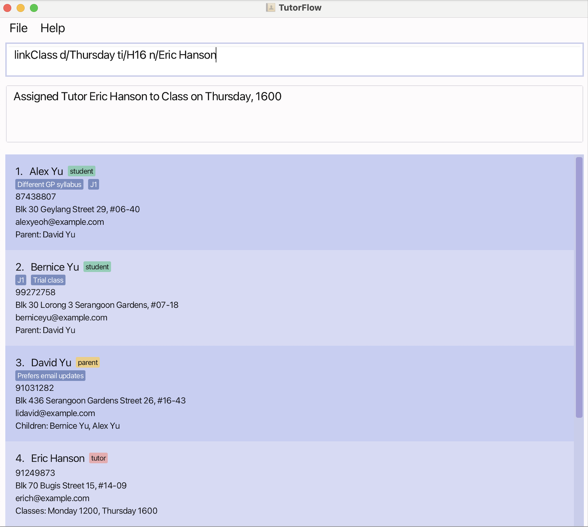

### Run a modern tuition centre — without spreadsheets!

**TutorFlow** is the desktop app for **GP tuition centre receptionists** to manage **JC-level tutees, tutors, and parents** in one place. Keep contacts, classes, schedules, and key notes organised and searchable — so you can spend less time coordinating and more time growing your centre.

- **Who it's for**: GP tuition centres and small-to-mid tuition teams
- **What it replaces**: Excel/Google Sheets class rosters, contacts lists, class scheduling

### Get started in minutes

- **Download TutorFlow**: [Latest Releases](https://github.com/AY2526S1-CS2103T-T11-4/tp/releases)
- **Quick Start**: [Open the User Guide → Quick Start](https://ay2526s1-cs2103t-t11-4.github.io/tp/UserGuide.html)
- **Need to extend/modify?** See the [Developer Guide](https://ay2526s1-cs2103t-t11-4.github.io/tp/DeveloperGuide.html)

### Key capabilities

- **Unified contact management**: Store and search tutees, tutors, and parents with essential details.
- **Class scheduling & tracking**: Organise classes, and assign tutees/tutors to them.
- **Fast keyboard-first commands**: Power users can manage data quickly with commands and shortcuts.
- **Reliable offline desktop app**: JavaFX-based app that runs locally and works without internet.

### Product screenshot

### Why TutorFlow

- **Operational clarity**: Know who is attending what class, who needs follow‑up, and which classes are running.
- **Less admin overhead**: Reduce manual coordination across spreadsheets and chats.
- **Built for teams**: Keeps information consistent and shareable across staff.

### Frequently used actions

- Add a new student, parent, or tutor
- Search for contacts quickly by name or attribute
- Find students' parents instantly
- Get class rosters

See full command details in the [User Guide](https://ay2526s1-cs2103t-t11-4.github.io/tp/UserGuide.html).

### Support and feedback

- Issues or feature requests: [Create an issue on GitHub](https://github.com/AY2526S1-CS2103T-T11-4/tp/issues)
- Documentation: [User Guide](https://ay2526s1-cs2103t-t11-4.github.io/tp/UserGuide.html) · [Developer Guide](https://ay2526s1-cs2103t-t11-4.github.io/tp/DeveloperGuide.html)

### Acknowledgements

- Based on AddressBook-Level3 by the [SE-EDU initiative](https://se-education.org)
- Libraries used: [JavaFX](https://openjfx.io/), [Jackson](https://github.com/FasterXML/jackson), [JUnit5](https://github.com/junit-team/junit5)
